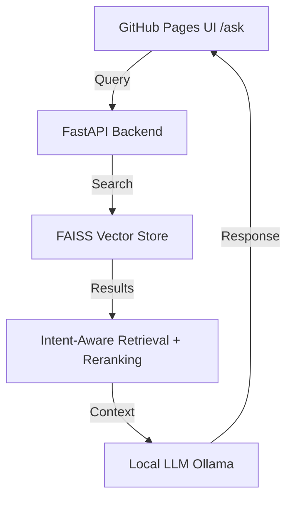

> The best way to learn something is to build it for yourself.

I wanted to learn **Retrieval-Augmented Generation (RAG)** properly — not by wiring together a toy chatbot, but by solving a problem I actually have.

I write long technical blogs on my website:
👉 [samitmohan.github.io](https://samitmohan.github.io)

They’re dense, opinionated, and sometimes hard to skim. I often find myself thinking:

*   *“Did I already write about this?”*
*   *“Where did I explain this idea?”*
*   *“Can I get a short, grounded explanation instead of rereading the whole post?”*

So I decided to build a RAG system over my own blog — essentially a smarter, explain-as-you-go `Ctrl+F` for everything I’ve written.

This post documents how I built it, what worked, what didn’t, and why certain design choices matter.

---

## What This Project Does

I built a retrieval-augmented question-answering system that:
1.  **Indexes** all my blog posts.
2.  **Retrieves** relevant text or code chunks based on semantic similarity.
3.  **Generates** grounded answers with citations using a local Large Language Model (LLM).

## Architecture

The high-level data flow looks like this:



```text
GitHub Pages UI (/ask)
        ↓
FastAPI backend
        ↓
FAISS vector store
        ↓
Intent-aware retrieval + reranking
        ↓
Local LLM (Ollama)
        ↓
Answer + sources
```

### Repo Structure

The project is organized to separate concerns between data ingestion, retrieval logic, and the API surface.

```text
blog-rag/
├── README.md
├── requirements.txt
├── .env.example
├── .gitignore
├── data/
│   ├── raw/                 # Raw blog markdown
│   └── embeddings/          # Persisted FAISS index + metadata
├── ingestion/
│   ├── load_github.py       # Fetch all blog posts
│   ├── parse_markdown.py    # Structured markdown parsing
│   ├── clean_text.py        # Normalize without summarizing
│   └── chunker.py           # Create retrieval units
├── embeddings/
│   ├── embed_chunks.py      # SentenceTransformer embeddings
│   └── vector_store.py      # FAISS + metadata store
├── retrieval/
│   └── retrieve.py          # Intent-aware retrieval + rerank
├── generation/
│   ├── prompt.py            # Prompt construction
│   └── answer.py            # LLM call + citations
├── api/
│   └── server.py            # FastAPI app
└── ask/
    └── index.html           # GitHub Pages frontend
```

### Core Goals

-**Ask questions** about my blogs, ideas, and explanations.
-**Get short, grounded answers** exclusively from my own writing.
-**Context-aware retrieval:** Fetch code when I ask for implementation, or explanations when I ask “why”.


-**Zero Hallucinations:** Never invent facts beyond the source material.
-**Local Execution:** Run entirely locally (no paid APIs required).

---

## Phase 1: Ingestion & Corpus Creation

**Goal:** Turn messy, real-world blog content into clean, inspectable retrieval units.

### 1. Loading Blog Data
All my blog posts already exist as Markdown files in my GitHub repository.
`load_github.py` simply fetches them directly from the source. This part was straightforward.

### 2. Parsing Markdown (Harder Than Expected)
Markdown can be messy. `parse_markdown.py` extracts structured data:
*   **Frontmatter:** Title, date, categories.
*   **Structure:** Section headings, paragraphs, code blocks, and links.

I avoided using a heavy-weight Markdown AST parser and instead relied on careful regex and structure matching. This gave me more control but was trickier to get right than I initially expected.

### 3. Cleaning Without Summarizing
The script `clean_text.py` handles normalization:
*   Normalizes whitespace.
*   Removes non-content "junk".
*   **Crucially:** Does *not* rewrite or summarize.
*   Preserves the original author's voice.

This is vital because **RAG quality starts with data integrity**. If the source data is lost or mutated, the retrieval will be flawed.

### 4. Chunking (The Most Important Step)
I spent the majority of my time on `chunker.py`.
A **chunk** is the smallest piece of text that should be retrieved on its own to answer a question.

**My Chunking Rules:**
*   One paragraph = one chunk.
*   Multiple sentences are fine.
*   Multiple distinct ideas are *not* fine in one chunk.
*   **Code blocks** are treated as separate chunks.
*   **Links** are embedded in text, not standalone.
*   Chunks must be **self-contained**.
*   Max length: ~200–300 words.

**Example Output:**

```json
{
  "id": "600LC_intro_0",
  "text": "nothing. spend your time doing something more meaningful...",
  "metadata": {
    "post_title": "600+ leetcode questions: lessons",
    "section": "intro",
    "date": "2025-10-25",
    "url": "/tech/2025/10/25/600LC.html",
    "type": "text"
  }
}
```

---

## Phase 2: Embeddings & Vector Store

### Embeddings
I utilize the **Sentence Transformers** library for generating embeddings:

```python
SentenceTransformerEmbeddings("all-MiniLM-L6-v2")
```

*   **384-dimensional vectors**
*   Fast inference
*   Runs locally
*   Excellent performance for semantic search

Both text and code are embedded using the same model, but they are flagged via metadata to distinguish between them during retrieval.

### Vector Store (FAISS)
I use **FAISS** (Facebook AI Similarity Search) to store the vectors efficiently. Since FAISS only stores the vectors themselves, I maintain a parallel metadata store:

```text
vector → embedding
payload → { id, text, metadata }
```

**Query Example:**
*   **Query:** “Why do we use softmax in MNIST?”
*   **Returns:**
    *   **Distance:** 0.29
    *   **Chunk:** "Softmax is used in MNIST classification..."

---

## Phase 3: Retrieval Control & Reranking

Raw semantic search isn’t always enough. User intent varies.

*   If I ask **“show me code”** → I want code blocks.
*   If I ask **“why does this work”** → I want conceptual explanations.

To handle this, `retrieve.py` implements an intent-aware pipeline:

```text
query
  ↓
intent classification
  ↓
embedding
  ↓
FAISS search
  ↓
intent-aware reranking
  ↓
top-k chunks
```

This step alone improved answer quality dramatically by filtering out irrelevant chunk types (e.g., ignoring text chunks when the user explicitly wants code).

---

## Phase 4: Prompting & Generation

### Prompt Construction
Context is king. I explicitly tell the LLM what each retrieved chunk represents to avoid confusion:

```text
[TEXT]
explanation...

[CODE]
code snippet...
```

Then I append the user's question. This simple formatting prevents the model from "guessing" the context type.

### Generation (Local LLM)
I rely on **Ollama** for local inference:

```bash
ollama serve
ollama pull qwen2.5:7b
```

*   **No cloud APIs**
*   **No token limits**
*   **No costs**

### Citations & Grounding
The system is designed to never hallucinate sources. Instead, it:
1.  Tracks exactly which chunks were used to generate the answer.
2.  Returns specific citations alongside the answer.

**Example Response:**
> **Answer:** Softmax converts logits into probabilities...
>
> **Sources:**
> *   `600+ leetcode questions: lessons_intro_0` (text, section=intro)

---

## Persistence & Deployment

### Persistence
The FAISS index and metadata are persisted to disk. On restart:
*   No re-embedding required.
*   No re-indexing required.
*   **Instant retrieval.**

This persistence is what separates a toy script from a usable tool.

### Frontend & Deployment
*   **UI:** Lives at [samitmohan.github.io/ask](/ask)
*   **Backend:** FastAPI
*   **Connectivity:** Cloudflare Tunnel (to expose the local server securely)
*   **Rendering:** Markdown + Sources

**Final Pipeline:**

1.  **GitHub Pages UI** captures input.
2.  **FastAPI backend** processes the request.
3.  **FAISS** performs retrieval.
4.  **Reranker** optimizes results based on intent.
5.  **Local LLM** generates the response.
6.  **UI** renders the grounded answer + sources.

---

## Final Thoughts

This project taught me several key lessons about building AI systems:

1.  **RAG is mostly data engineering**, not just model selection.
2.  **Chunking strategy** matters more than the specific embedding model.
3.  **Intent control** beats simply using larger embeddings.
4.  **Local LLMs** are surprisingly capable for many real-world use cases.

And most importantly:

> **Building something for yourself teaches you far more than building a demo.**

<video width="100%" height="auto" controls>
  <source src="/assets/videos/rag.mov" type="video/mp4">
  Your browser does not support the video tag.
</video>


In addition to vector semantic search, it now gives a score boost
     (multiplier) to chunks that contain the exact keywords from your query. This ensures
     that if you ask for "Softmax", chunks actually containing the word "Softmax" float to
     the top, making the "offline" results much sharper